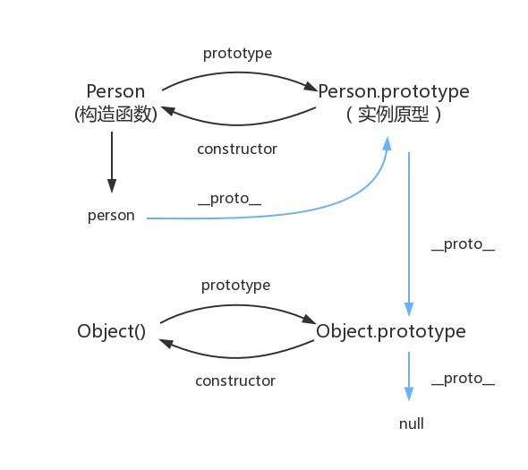

# 说说JavaScript中的数据类型?

## 1.数据类型：
> 基本类型：Number、Boolean、String、Symbol、BigInt、undefined、null
> 引用类型：Object（Object是大类、function函数、array数组、date日期等都属于Object）

备注：Symbol和BigInt都是es6中新增数据类型  
1.Symbol表示独一无二不可变的数据，主要是用来解决全局变量冲突。如果用Symbol作为对象里的属性名，概属性则不会出现在for...in、for...of循环中，也不会出现在Object.keys()、Object.getOwnPropertyName()、Json.stringify()返回里。但是可以通过Object.getOwnPropertySymbols方法返回(以数组形式排列)  
2.Symbol():每次都会产生一个全新的Symbol。Symbol.for()：不会每次都产生全新的，他会检测给定的Key是否已经存在，如果不存在则会创建。Symbol.keyFor()：返回一个已经登记的Symbol类型值的key  
***
```
let s1=Symbol.for('foo');
Symbol.keyFor(s1); // foo
let s2=Symbol('foo')
Symbol.keyFor(s2); //undefined
```


## 2.类型转换
+ 强制转换（显示转换）
+ 自动转换（隐式转换）

> 显示转换：Number()、parseInt()、String()、Boolean()  
> 1. Number转换的时候是很严格的，只要有一个字符无法转成数值，整个字符串就会被转为NaN  
> 2. parseInt转换没这么严格，函数会逐个解析字符串，遇到不能转换的字符就停下来  
> 3. string可以将任意类型转成字符串
> 4. Boolean可以将任意转换成布尔值
```
Number('324') // 324
Number('324abc') // NaN
Number('') // 0
Number(true) // 1
Number(false) // 0
Number(undefined) // NaN
Number(null) // 0
//对象：通常转为NaN，除非只包含单个数值的数组
Number({a:1}) // NaN
Number([1,2,3]) // NaN
Number([5]) // 5

parseInt('32a32') //32

string({a:1}) //"[object object]"

//在Boolean里undefined、null、false、0、NaN、‘’ 都转为false
```

> 隐式转换（常见的两种场景）  
> 1. 比较运算符（==、!=、>、<、if、while等）需要用到布尔值的地方
> 2. 算术运算符（+、-、/、*）  
>   经常发生在+运算符中，一旦存在字符串，则会进行字符串拼接操作
>   除了+有可能把运算符转成字符串，其他运算符都会把运算子转成数值
```
// 会把运算子转成字符串
'6'+1 // 61
'6'+true // 6true
'6'+false // 6false
'6'+{a:1} // 6[object object]
'6'+ [] // 6
'6'+ function(){} //6function(){}
'6'+ undefined //6undefined
'6'+ null //6null

//会把运算子转成数值
'6'-'2' // 4
'6'*'2' // 12
true-1 // 0
false-1 // -1
'1'-1 // 0
'6'*[] // 0
'6'*{a:1} // NaN
false/5 // 0
'abc'-1 // NaN
//null转换成0，undefined转换为NaN
null+1 // 1
undefined+1 // NaN   
```

## 3.如何判断数据类型
1. typeof：可以用来判断基本数据类型，其中null会被转成object
2. instanceof：只能用于判断构造函数的prototype属性是否出现在某个实例对象的原型链上，而不能判断是否是处于原型链最后一位，所以会有如下情况。但是不能用于判断基本数据类型。
``` 
    let arr = [1,2,3];
    console.log(arr instanceof Array); // true
    console.log(arr instanceof Object); // true
    function fun(){}
    console.log(fun instanceof Function); // true
    console.log(fun instanceof Object); // true
```
3. constructor：通过找到直接创造实例的构造函数，但是constructor并不稳定，因为有可能类的原型重写，在重写的过程中可能会把constructor覆盖掉。但是constructor不能用于null和undefined，因为他们没有这个属性。
```
    function Person(){}
    //方法一、给原型对象增加属性和方法（不会被覆盖）
    Person.prototype.job = 'test';
    //方法二、通过一个包含所有属性和方法的字面量来重写原型对象,经过这样后，对象的prototype转而指向了Object（会被覆盖）
    Person.prototype = {
        name: 'Ni',
        age:29,
        sayName: function(){
            console.log(this.name);
        }
    }
    let friend = new Person();
    console.log(friend instanceof Person); // true
    console.log(friend.constructor === Person); // false
    console.log(friend.constructor === Object); // true
```
4. Object.prototype.toSting.call()：对于Object.prototype.toSting.call方法会返回一个形如“[object XXX]”的字符串，如果对象的toString方法被重写，这个时候就需要call方法来调用。如果参数为null 或者 undefined，则直接返回结果（"[object Null]、[object undefined]"）,如果参数是其他值，则将参数转为对象，再做判断。
   


## 4.存储位置
1. 基本数据类型的内存分配：直接将数据存储在栈空间。
2. 引用数据类型的内存分配：将数据地址存储在栈空间，真正的数据存储在堆空间中。（堆内存是无序存储，可以根据引用直接获取。）


