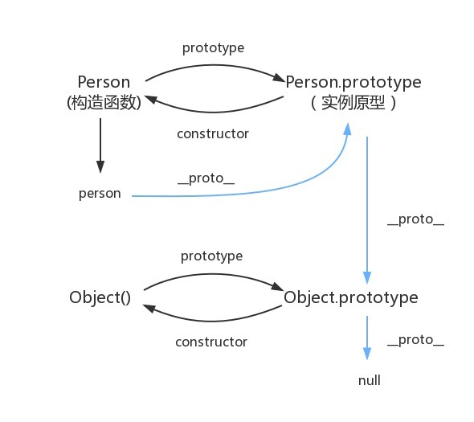

<!--
 * @Author: llsldwy lilin5@126.com
 * @Date: 2023-07-04 13:34:53
 * @LastEditors: llsldwy lilin5@126.com
 * @LastEditTime: 2023-07-04 14:30:41
 * @FilePath: /web-front-study/javascript/08.JavaScript原型，原型链 ? 有什么特点？.md
-->
# JavaScript原型，原型链 ? 有什么特点？

## 原型
> JavaScript 常被描述为一种基于原型的语言——每个对象拥有一个原型对象，当试图访问一个对象的属性时，它不仅仅在该对象上搜寻，还会搜寻该对象的原型，以及该对象的原型的原型，依次层层向上搜索，直到找到一个名字匹配的属性或到达原型链的末尾。准确地说，这些属性和方法定义在Object的构造器函数（constructor functions）之上的prototype属性上，而非实例对象本身。  

> 下面举个例子：函数可以有属性。 每个函数都有一个特殊的属性叫作原型prototype
```
function Person(){}
console.log( Person.prototype );
```
```
//控制台输出
{
    constructor: ƒ Person(),
    __proto__: {
        constructor: ƒ Object(),
        hasOwnProperty: ƒ hasOwnProperty(),
        isPrototypeOf: ƒ isPrototypeOf(),
        propertyIsEnumerable: ƒ propertyIsEnumerable(),
        toLocaleString: ƒ toLocaleString(),
        toString: ƒ toString(),
        valueOf: ƒ valueOf()
    }
}
```
> 上面这个对象，就是大家常说的原型对象。可以看到，原型对象有一个自有属性constructor，这个属性指向该函数，如下图关系展示。  



## 原型链
> 原型对象也可能拥有原型，并从中继承方法和属性，一层一层、以此类推。这种关系常被称为原型链 (prototype chain)，它解释了为何一个对象会拥有定义在其他对象中的属性和方法。在对象实例和它的构造器之间建立一个链接（它是__proto__属性，是从构造函数的prototype属性派生的），之后通过上溯原型链，在构造器中找到这些属性和方法。  
下面举个例子：
```
function Person(name) {
    this.name = name;
    this.age = 18;
    this.sayName = function() {
        console.log(this.name);
    }
}
// 第二步 创建实例
var person = new Person('person')
```
根据代码，我们可以得到下图


下面分析一下：
+ 构造函数Person存在原型对象Person.prototype
+ 构造函数生成实例对象person，person的__proto__指向构造函数Person原型对象
+ Person.prototype.__proto__ 指向内置对象，因为 Person.prototype 是个对象，默认是由 Object 函数作为类创建的，而 Object.prototype 为内置对象
+ Person.__proto__ 指向内置匿名函数 anonymous，因为 Person 是个函数对象，默认由 Function 作为类创建
+ Function.prototype 和 Function.__proto__ 同时指向内置匿名函数 anonymous，这样原型链的终点就是 null  


## 总结
下面首先要看几个概念：
__proto__作为不同对象之间的桥梁，用来指向创建它的构造函数的原型对象


1. 每个对象的__proto__都是指向它的构造函数的原型对象prototype的
```
    person1.__proto__ === Person.prototype
```
2. 构造函数是一个函数对象，是通过 Function 构造器产生的
```
    Person.__proto__ === Function.prototype
```
3. 原型对象本身是一个普通对象，而普通对象的构造函数都是Object
```
    Person.prototype.__proto__ === Object.prototype
```
4. 刚刚上面说了，所有的构造器都是函数对象，函数对象都是 Function 构造产生的
```
    Object.__proto__ === Function.prototype
```
5. Object 的原型对象也有__proto__属性指向null，null是原型链的顶端
```
    Object.prototype.__proto__ === null
```
下面作出总结：
+ 一切对象都是继承自Object对象，Object 对象直接继承根源对象 null
+ 一切的函数对象（包括 Object 对象），都是继承自 Function 对象
+ Object 对象直接继承自 Function 对象
+ Function对象的__proto__会指向自己的原型对象，最终还是继承自Object对象

参考链接：
https://juejin.cn/post/6870732239556640775#heading-7
https://developer.mozilla.org/zh-CN/docs/Web/JavaScript/Inheritance_and_the_prototype_chain