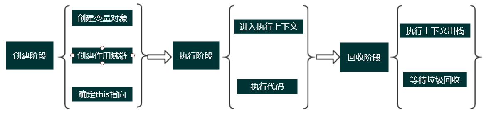

# JavaScript中执行上下文和执行栈是什么？

## 执行上下文
> 当 JavaScript 代码执行一段可执行代码(executable code)时，会创建对应的执行上下文(execution context)。执行上下文（可执行代码段）总共有三种类型：
+ 全局执行上下文（全局代码）：不在任何函数中的代码都位于全局执行上下文中，只有一个，浏览器中的全局对象就是 window 对象，this 指向这个全局对象。
+ 函数执行上下文（函数体）：只有调用函数时，才会为该函数创建一个新的执行上下文，可以存在无数个，每当一个新的执行上下文被创建，它都会按照特定的顺序执行一系列步骤。
+ Eval 函数执行上下文（eval代码）： 指的是运行在 eval 函数中的代码，很少用而且不建议使用。

> 执行上下文又包括三个生命周期阶段：创建阶段→执行阶段→回收阶段，本文重点介绍创建阶段。
1. 创建阶段
> 当函数被调用，但未执行任何其内部代码之前，会做以下三件事:
+ 创建变量对象(Variable object，VO)：首先初始化函数的参数arguments，提升函数声明和变量声明。
+ 创建作用域链（Scope Chain）：在执行上下文的创建阶段，作用域链是在变量对象之后创建的。作用域链本身包含变量对象。作用域链用于解析变量。当被要求解析变量时，JavaScript 始终从代码嵌套的最内层开始，如果最内层没有找到变量，就会跳转到上一层父作用域中查找，直到找到该变量。后文会详细说明。
+ 确定this指向：包括多种情况，后文会详细说明。

2. 执行阶段
> 进入执行上下文、执行代码

3. 回收阶段
> 执行完毕后执行上下文出栈等待垃圾回收

 
 